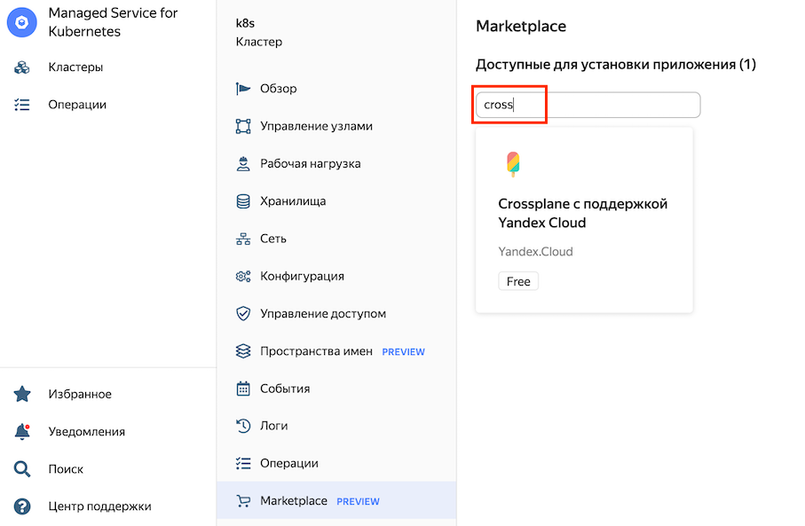

## Практическое задание #4. Работа с Crossplane

Список задач практического задания:
* 4.1 [Подготовка к развёртыванию Crossplane](#h4-1)
* 4.2 [Установка Crossplane в кластер Kubernetes](#h4-2)
* 4.3 [Развёртывание ВМ с веб-сервером](#h4-3)
* 4.4 [Удаление ВМ](#h4-4)


### 4.1 Подготовка к развёртывания Crossplane <a id="h4-1"/></a>

Включение NAT для подсети в которой находится worker node кластера Kubernetes.

Для этого нужно перейти в дашборд каталога, выбрать сервис `"Virtual Private Cloud"`, после чего выбрать виртуальную сеть.
Справа у нужной подсети нажать на символ с тремя точками и выбрать `Включить NAT в интернет`.



Убедиться, что в столбце "NAT в интернет" для нужной подсети статус изменился на `"включен"`.


Создание пространства имен (namespace) для Crossplane в кластере Kubernetes:

```bash
cd ~/labs/lab-04-crossplane
k create ns crossplane-system
```

### 4.2 Развёртывания Crossplane <a id="h4-2"/></a>

В [облачной консоли](https://console.cloud.yandex.ru) перейти в дашборд каталога. Далее в списке сервисов выбрать `"Managed Service for Kubernetes > Кластеры > k8s"` и открыть конфигурацию развёрнутого в предыдущем задании кластера Kubernetes.

В меню слева выбрать `Marketplace` и в поле ввода `"Доступные для установки приложения"` написать `cross`, после чего выбрать приложение `"Crossplane с поддержкой Yandex Cloud"`. Далее нажать на кнопку `"Использовать"`.


В открывшейся форме `"Настройки приложения"`:
* выбрать в списке пространство имен `crossplane-system`
* Нажать на кнопку `"Создать новый"` для создания нового ключа к существующему сервисному аккаунту `user-<3-цифры>-svc`

После заполнения всех полей формы необходимо нажать на кнопку `"Установить"`. 


Дождаться пока Crossplane перейдёт в состояние `Deployed`.


Применить в кластер Kubernetes манифест Crossplane ProviderConfig:
```bash
kubectl apply -f providerconfig.yml
```


### 4.3 Развёртывание ВМ с веб-сервером <a id="h4-3"/></a>

Подготовить исходные данные для заполнения шаблона манифеста:
```bash
export META_ID=$(curl -s http://169.254.169.254/latest/meta-data/instance-id)
export META_IP=$(curl -s http://169.254.169.254/latest/meta-data/local-ipv4)
export FOLDER_ID=$(yc config get folder-id)
export IMAGE_ID=$(yc compute image get --folder-id standard-images --name=lemp-v20220606 --format=json | jq -r .id)
export SUBNET_ID=$(yc compute instance get --id=$META_ID --format=json | jq -r .network_interfaces[0].subnet_id)
export NET_ID=$(yc vpc subnet get $SUBNET_ID --format=json | jq -r .network_id)
export SUBNET_PREFIX=$(yc vpc subnet get $SUBNET_ID --format=json | jq -r .v4_cidr_blocks[0])
export ZONE_ID=$(yc vpc subnet get $SUBNET_ID --format=json | jq -r .zone_id)
export NET_NAME=$(yc vpc network get $NET_ID --format=json | jq -r .name)

export FN="vm-instance.yml"
export VM_NAME="crossplane-vm"
```

Заполнить манифест нужными значениями из исходных данных:
```bash
envsubst < vm-inst-tmpl.yml > vm-instance.yml
```

Создать ВМ с LEMP стеком:
```bash
kubectl apply -f vm-instance.yml
```

Проверить работоспособность развёрнутой ВМ:
```bash
yc compute instance list
LEMP_IP=$(yc compute instance get --name=$VM_NAME --format=json | jq -r .network_interfaces[0].primary_v4_address.address)

ping $LEMP_IP
curl http://$LEMP_IP
```

### 4.3 Удаление ВМ с веб-сервером <a id="h4-3"/></a>

Удалить ВМ и проверить список виртуальных машин:
```bash
kubectl delete instance $VM_NAME
yc compute instance list
```

`Поздравляем! Вы успешно справились с заданием!`

### [ << задание 3 ](../lab-03-terraform/README.md) || [задание 5 >>](../lab-05-pulumi/README.md)
### [ << оглавление ](../README.md)
